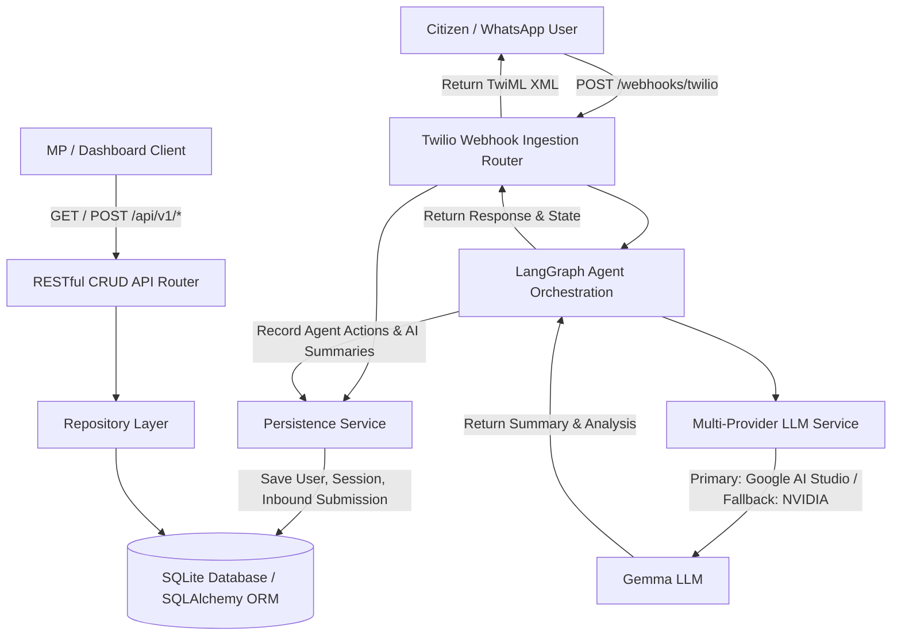

# Sauti AI System Architecture

**Project:** Sauti AI — Civic Intelligence Platform for Members of Parliament  
**Sprint:** Sprint 4 — Data Foundation

---

## Architectural Data Flow

---

## System Components

### 1. Ingestion Layer (`app/api/webhook.py` & `app/schemas/webhook.py`)

- Accepts form-encoded payloads from Twilio WhatsApp Sandbox.
- Parses media attachments and profile information.
- Always returns TwiML HTTP 200 with graceful fallback handling.

### 2. Multi-Provider LLM Abstraction (`app/services/llm/`)

- Unified `LLMProvider` interface wrapping Google AI Studio (`google-genai`) and NVIDIA Hosted Gemma 4.
- Centralized backoff retry mechanism handling 429/5xx transient errors.
- Feature flag control via `LLM_PROVIDER` environment variable.

### 3. Agent Orchestration (`app/agent/`)

- LangGraph graph execution: `intake -> analyze -> respond -> END`.
- State mutation flow tracking execution steps and metadata.

### 4. Data & Persistence Layer (`app/db/`, `app/models/`, `app/repositories/`)

- Relational schema covering Users, Sessions, Submissions, Issues, Clusters, Infrastructure, Projects, Agent Actions, and AI Summaries.
- Alembic database migration support.
- Repository layer (`UserRepository`, `SubmissionRepository`, `InfrastructureRepository`, `ProjectRepository`, etc.) providing clean data access methods.
- Seed script (`app/db/seed.py`) delivering realistic data for 6 constituencies.

### 5. RESTful CRUD API (`app/api/crud.py`)

- Standardized API endpoints under `/api/v1/` exposing CRUD operations for users, submissions, infrastructure assets, projects, issues, sessions, and clusters.

Citizen

↓

Twilio

↓

Webhook

↓

LangGraph

↓

Intent Classifier

↓

Retrieval Service

↓

Repositories

↓

SQLite

↓

Context Builder

↓

Gemma 4

↓

Grounded Response
