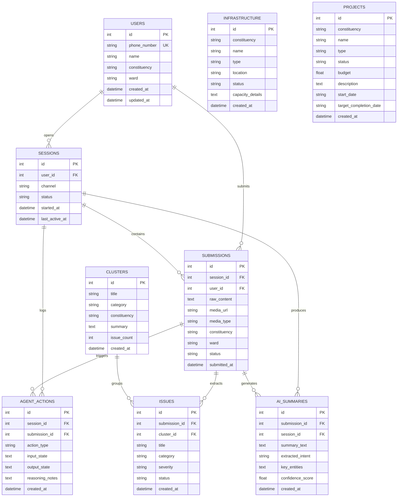

# Database Schema & Entity Relationship Specification

**Project:** Sauti AI  
**Database Engine:** SQLite (SQLAlchemy ORM + Alembic Migrations)  
**Sprint:** Sprint 4 — Data Foundation  

---

## Entity Relationship Diagram

---

## Tables & Schema Reference

### 1. `users`
Represents citizens submitting feedback/complaints.
- `id` (INTEGER, Primary Key, Autoincrement)
- `phone_number` (VARCHAR(50), Unique, Indexed, NOT NULL)
- `name` (VARCHAR(100), Nullable)
- `constituency` (VARCHAR(100), Indexed, Nullable)
- `ward` (VARCHAR(100), Nullable)
- `created_at` (DATETIME, Default UTC)
- `updated_at` (DATETIME, Default UTC)

### 2. `sessions`
Groups individual citizen interactions into logical conversation sessions.
- `id` (INTEGER, Primary Key, Autoincrement)
- `user_id` (INTEGER, Foreign Key -> `users.id`, Indexed, NOT NULL)
- `channel` (VARCHAR(50), Default `'whatsapp'`)
- `status` (VARCHAR(50), Default `'active'`)
- `started_at` (DATETIME, Default UTC)
- `last_active_at` (DATETIME, Default UTC)

### 3. `submissions`
Inbound raw citizen feedback/complaints ingested via WhatsApp webhook or API.
- `id` (INTEGER, Primary Key, Autoincrement)
- `session_id` (INTEGER, Foreign Key -> `sessions.id`, Indexed, Nullable)
- `user_id` (INTEGER, Foreign Key -> `users.id`, Indexed, NOT NULL)
- `raw_content` (TEXT, NOT NULL)
- `media_url` (VARCHAR(500), Nullable)
- `media_type` (VARCHAR(100), Nullable)
- `constituency` (VARCHAR(100), Indexed, Nullable)
- `ward` (VARCHAR(100), Nullable)
- `status` (VARCHAR(50), Default `'received'`)
- `submitted_at` (DATETIME, Default UTC)

### 4. `issues`
Categorized civic issues extracted from submissions.
- `id` (INTEGER, Primary Key, Autoincrement)
- `submission_id` (INTEGER, Foreign Key -> `submissions.id`, Indexed, NOT NULL)
- `cluster_id` (INTEGER, Foreign Key -> `clusters.id`, Indexed, Nullable)
- `title` (VARCHAR(200), NOT NULL)
- `category` (VARCHAR(100), Indexed, NOT NULL)
- `severity` (VARCHAR(50), Default `'medium'`)
- `status` (VARCHAR(50), Default `'open'`)
- `created_at` (DATETIME, Default UTC)

### 5. `clusters`
Thematic aggregations of similar civic issues across constituencies.
- `id` (INTEGER, Primary Key, Autoincrement)
- `title` (VARCHAR(200), NOT NULL)
- `category` (VARCHAR(100), Indexed, NOT NULL)
- `constituency` (VARCHAR(100), Indexed, Nullable)
- `summary` (TEXT, NOT NULL)
- `issue_count` (INTEGER, Default 1)
- `created_at` (DATETIME, Default UTC)

### 6. `infrastructure`
Constituency physical infrastructure assets across Likoni, Mvita, Nyali, Kisauni, Changamwe, Jomvu.
- `id` (INTEGER, Primary Key, Autoincrement)
- `constituency` (VARCHAR(100), Indexed, NOT NULL)
- `name` (VARCHAR(200), NOT NULL)
- `type` (VARCHAR(100), Indexed, NOT NULL) — Roads, Schools, Hospitals, Markets, Water points, Boreholes, Bridges
- `location` (VARCHAR(200), Nullable)
- `status` (VARCHAR(50), Default `'operational'`)
- `capacity_details` (TEXT, Nullable)
- `created_at` (DATETIME, Default UTC)

### 7. `projects`
Constituency development projects.
- `id` (INTEGER, Primary Key, Autoincrement)
- `constituency` (VARCHAR(100), Indexed, NOT NULL)
- `name` (VARCHAR(200), NOT NULL)
- `type` (VARCHAR(100), Indexed, NOT NULL)
- `status` (VARCHAR(50), Indexed, NOT NULL) — Ongoing, Planned, Completed
- `budget` (FLOAT, Default 0.0)
- `description` (TEXT, Nullable)
- `start_date` (VARCHAR(50), Nullable)
- `target_completion_date` (VARCHAR(50), Nullable)
- `created_at` (DATETIME, Default UTC)

### 8. `agent_actions`
Audit and trace log of steps executed by the LangGraph agent graph.
- `id` (INTEGER, Primary Key, Autoincrement)
- `session_id` (INTEGER, Foreign Key -> `sessions.id`, Indexed, Nullable)
- `submission_id` (INTEGER, Foreign Key -> `submissions.id`, Indexed, Nullable)
- `action_type` (VARCHAR(100), Indexed, NOT NULL)
- `input_state` (TEXT, Nullable)
- `output_state` (TEXT, Nullable)
- `reasoning_notes` (TEXT, Nullable)
- `created_at` (DATETIME, Default UTC)

### 9. `ai_summaries`
Persisted AI summaries, intent classifications, and reasoning output.
- `id` (INTEGER, Primary Key, Autoincrement)
- `submission_id` (INTEGER, Foreign Key -> `submissions.id`, Indexed, Nullable)
- `session_id` (INTEGER, Foreign Key -> `sessions.id`, Indexed, Nullable)
- `summary_text` (TEXT, NOT NULL)
- `extracted_intent` (VARCHAR(100), Nullable)
- `key_entities` (TEXT, Nullable)
- `confidence_score` (FLOAT, Nullable)
- `created_at` (DATETIME, Default UTC)

---

## Seed Dataset Coverage

Automated via `app/db/seed.py`:
- **6 Target Constituencies:** Likoni, Mvita, Nyali, Kisauni, Changamwe, Jomvu.
- **7 Infrastructure Types:** Roads, Schools, Hospitals, Markets, Water points, Boreholes, Bridges (42 items total).
- **3 Project Statuses:** Ongoing, Planned, Completed (18 projects total).
- **Sample Citizen Users & Submissions:** Pre-populated complaints and AI summaries for testing.

---

## Future Migrations & Database Evolutions

- **PostgreSQL / Neon Migration:** Change `database_url` in `.env` to `postgresql://...` — Alembic migrations are dialect-agnostic.
- **pgvector Extension:** Add vector embedding columns to `ai_summaries` and `clusters` for Sprint 5 RAG retrieval.
